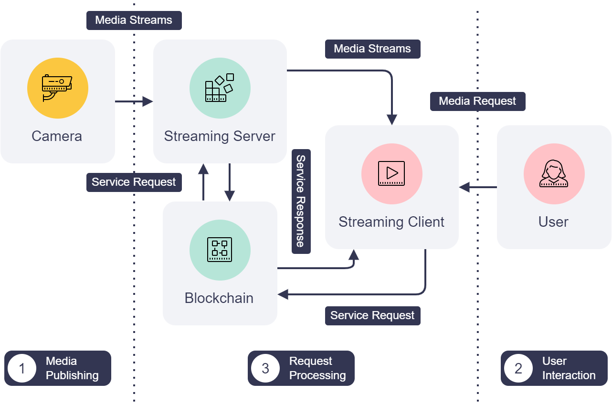

# CrystalBall

An Android app that streams live video feeds of IoT devices using IoT Service Blockchain.

<table>
<tr>
<td>

</td>
<td>

</td>
</tr>
</table>

## System Architecture & Components



- **Server**

    An IoT devices such as a surveillance camera can publish its media stream to the streaming server.
    The server is connected to the IoT Service Blockchain and listens for viewing request of streaming
    clients.
    When receive such request, the server respond a URL of the published media stream with access
    token for viewing through the blockchain.

    _Source code: [server](./server/)_

- **App**

    The App is an IoT media streaming client which let user view the published media streams.
    It request stream URL and access token from the server via the IoT Service Blockchain.
    The user can also manage a list of connection profiles through the app for quick access.

    _Source code: [app](./app/)_


## Installation & Running

### Prerequisites

- A running [Hyperledger Fabric](https://www.hyperledger.org/use/fabric) network of version 2.4 or
    newer
- Install [IoT Service Blockchain](https://github.com/nexus-lab/iot-service-blockchain) chaincode
    to your Hyperledger Fabric network
- [Go](https://go.dev/) 1.16 or newer
- [Android Studio](https://developer.android.com/studio/) and Android SDK
- [FFmpeg](https://ffmpeg.org/)
- A camera device
- Clone this repository, change working directory to `crystalball`

    ```
    $ git clone https://github.com/nexus-lab/iot-service-blockchain-samples.git
    $ cd iot-service-blockchain-samples/crystalball
    ```

### Server

1. Change working directory to `server`:

    ```
    $ cd server
    ```

1. Install Go dependencies:

    ```
    $ go mod download
    ```

1. Copy `config.yml.example` to `config.yml`.
    Fill in or change configurations according to your Hyperledger Fabric configurations.
    Configuration details are given in the comments.

    ```
    $ cp config.yml.example config.yml
    ```

1. Run the server:

   ```
   go run *.go --config config.yml
   ```

1. On your IoT device or PC that connects to the camera, publish the camera's media streams to the
    server.
    For example, you can stream your web camera with [`ffmpeg`](https://ffmpeg.org/):

    ```
    ffmpeg -f v4l2 -framerate 10 -video_size 1280x720 -input_format mjpeg -i <camera_device_name> -vcodec libx264 \
            -f flv rtmp://<streaming_server_address>/?key=<streaming_key>
    ```

    `<camera_device_name>` is the device name of your camera.
    `<streaming_service_address>` is the listening public address of your server.
    It could be the `external_addr` set in the `config.yml` file.
    `<streaming_key>` is the `key` you set in the `config.yml` file.

    You can also publish a dummy video to the server for testing:

    ```
    ffmpeg -re -i dummy.flv -c copy -f flv rtmp://<streaming_server_address>/?key=<streaming_key>
    ```

### App

1. Change working directory to `app`:

    ```
    $ cd app
    ```

1. You will need to authenticate to GitHub Packages using a personal access token.
    Read [this](https://docs.github.com/en/packages/working-with-a-github-packages-registry/working-with-the-gradle-registry#authenticating-with-a-personal-access-token) for details.
    After creating your personal access token, copy `github.properties.example` to
    `github.properties` and put your GitHub user name and token there:

    ```
    cp github.properties.example github.properties
    ```

1. Compile and package the app using Android Studio or Gradle CLI.

1. Install and run the app in an Android device or emulator.

1. Open the Settings page from the top right gear icon and fill in your Hyperledger Fabric user
    identity information, gateway information, and IoT Service Blockchain chaincode information.
    Those information may be different from the credentials used by the server's `config.yml`.
    Additionally, you can import or export settings from/to a JSON file.

    

1. Tap on the add icon on the home page and add a new service by its organization ID, device ID,
    and service name.
    You can also add a service by scanning its QR code on the
    [IoT Service Blockchain Explorer](../explorer/README.md) website.

    

1. Once a service is added, you can review its details and play its video feed.
