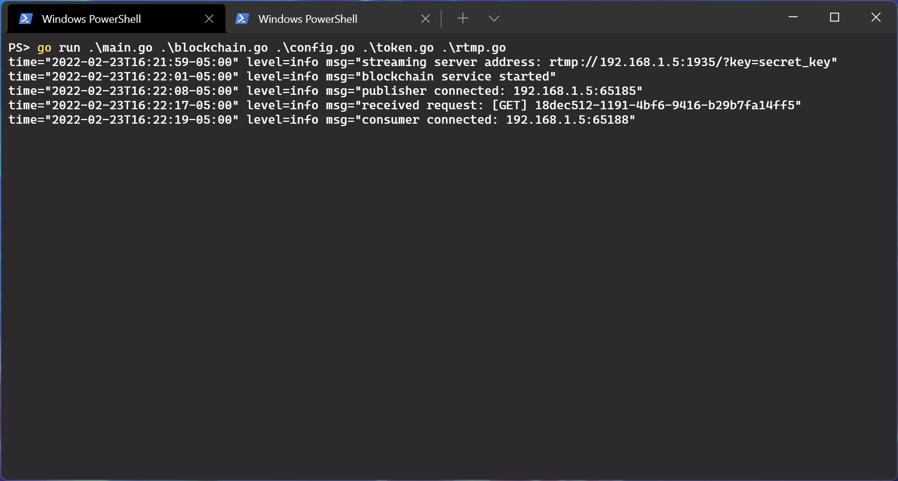
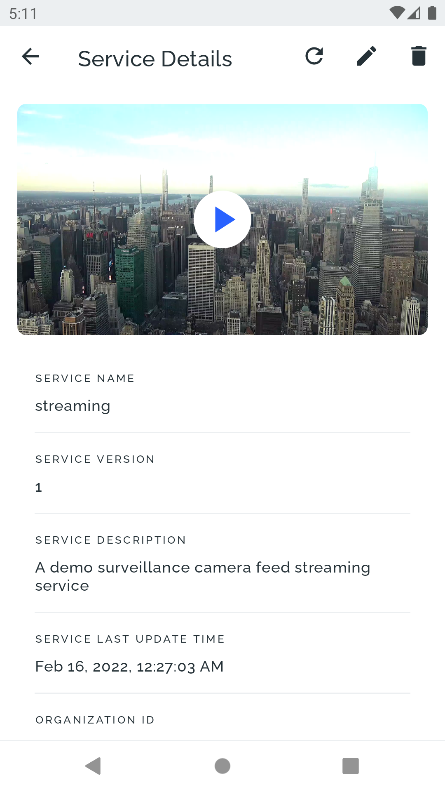
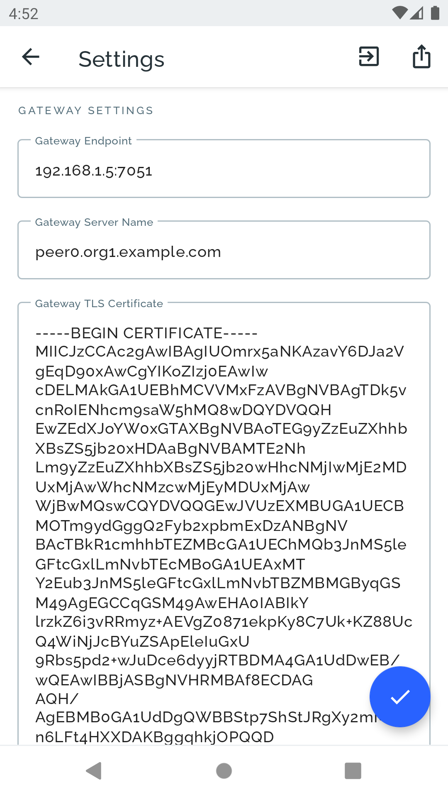
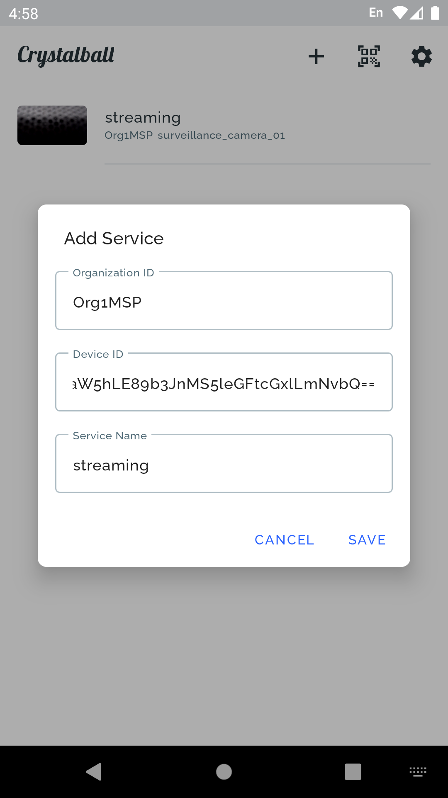

# CrystalBall

An Android app that streams live video feeds of IoT devices using IoT Service Blockchain.

<table>
<tr>
<td>

</td>
<td>

</td>
</tr>
</table>

## Installation & Running

### Server

1. Install [Go](https://go.dev/).

2. Clone this repository and change working directory to `crystalball/server`:

   ```shell
   git clone https://github.com/nexus-lab/iot-service-blockchain-samples.git
   cd crystalball/server
   ```

3. Install dependencies:

   ```shell
   go mod download
   ```

4. Copy `config.yml.example` to `config.yml` and replace the placeholder values with your
   Hyperledger Fabric user identity information, gateway information, and IoT Service Blockchain
   chaincode information.
   `stream.addr` will be a public address that the CrystallBall app uses to fetch video streams.
   `stream.key` is to be appended to the `stream.addr` to restrict video feed publishing to anyone
   with the key.

   ```shell
   cp config.yml.example config.yml
   ```

5. Run the server:

   ```shell
   go run *.go
   ```

6. On your IoT device or gateway, publish the video stream to the server.
   For example, you can use [`ffmpeg`](https://ffmpeg.org/) to publish the video stream of a USB
   camera to the server:

   ```shell
   ffmpeg -f v4l2 -framerate 10 -video_size 1280x720 -input_format mjpeg -i /dev/video0 -vcodec libx264 -f flv rtmp://<stream.addr>/?key=<stream.key>
   ```

   Notice that your video device and parameters are most likely different from the example above.

   You can also publish a dummy video to the server for testing:

   ```shell
   ffmpeg -re -i dummy.flv -c copy -f flv rtmp://<stream.addr>/?key=<stream.key>
   ```

### App

1. Install [Android Studio](https://developer.android.com/studio/) and Android SDK.

2. Clone this repository and change working directory to `crystalball/app`:

   ```shell
   git clone https://github.com/nexus-lab/iot-service-blockchain-samples.git
   cd crystalball/app
   ```

3. You will need to authenticate to GitHub Packages using a personal access token.
   Read [this](https://docs.github.com/en/packages/working-with-a-github-packages-registry/working-with-the-gradle-registry#authenticating-with-a-personal-access-token) for details.
   After creating your personal access token, copy `github.properties.example` to `github.properties`
   and put your GitHub user name and token there.


   ```shell
   cp github.properties.example github.properties
   ```

4. Compile and package the app using Android Studio.

5. Install and run the app in an Android device or emulator.

6. Open the Settings page from the top right gear icon and fill in your Hyperledger Fabric user
   identity information, gateway information, and IoT Service Blockchain chaincode information.
   Those information can be different from the credentials used by the server.
   You may also import/export settings from/to a JSON file.

   

7. Click the add icon on the home page and add a new service by its organization ID, device ID,
   and service name.
   You can also add a service by scanning its QR code on the [IoT Service Blockchain Explorer](../explorer/README.md)
   website.

   

8. Once a service is added, you can check out its details and play its video feed.
