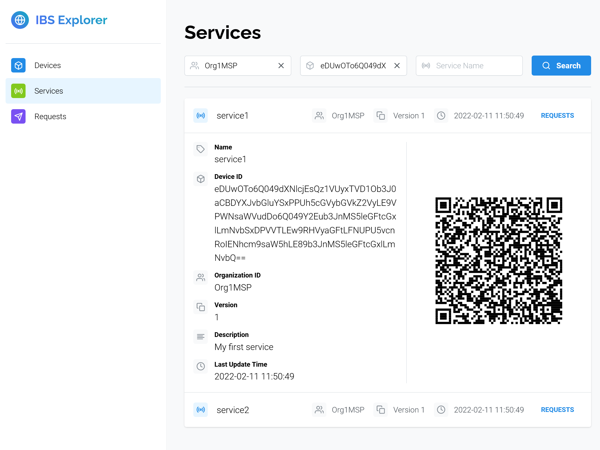

# IoT Service Blockchain Explorer

Explore registered devices, services, and service requests/responses on IoT Service Blockchain.



## Installation & Running

1. Install [Node.js](https://nodejs.org/) and [Yarn](https://classic.yarnpkg.com/).

2. Clone this repository and change working directory to `explorer`:

    ```shell
    git clone https://github.com/nexus-lab/iot-service-blockchain-samples.git
    cd explorer
    ```

3. Install dependencies:

    ```shell
    yarn
    ```

4. Copy `config.yml.example` to `config.yml` and replace the placeholder values with your
    Hyperledger Fabric user identity information, gateway information, and IoT Service Blockchain
    chaincode information.

    ```shell
    cp config.yml.example config.yml
    ```

4. Build and run this project:

    ```shell
    yarn build
    yarn start
    ```
